# SQUI Architecture

## Overview

SQUI (SPARQL Query UI) is a modern web component for composing, executing, and visualizing SPARQL queries. Built with Svelte 5 and the IBM Carbon Design System, it provides a complete SPARQL development environment that can be embedded in any web application.

### Key Technologies

| Technology | Purpose |
|------------|---------|
| **Svelte 5** | Framework with runes-based reactivity |
| **TypeScript** | Type-safe development (strict mode) |
| **Carbon Design System** | Enterprise UI components and design tokens |
| **CodeMirror 6** | SPARQL editor with syntax highlighting |
| **wx-svelte-grid** | High-performance data grid with virtual scrolling |
| **N3.js** | RDF parsing for service descriptions |

## System Architecture

SQUI follows a layered architecture with clear separation of concerns:

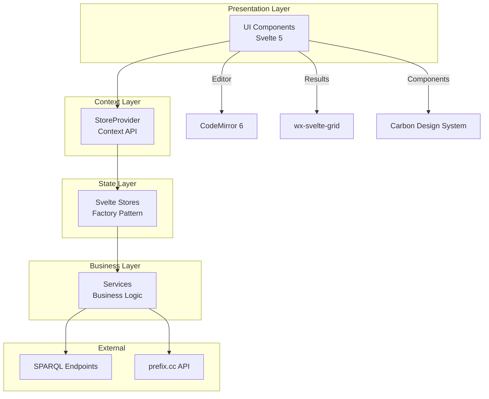

### Layer Responsibilities

| Layer | Responsibility |
|-------|----------------|
| **Presentation** | Render UI, handle user interactions, display data |
| **Context** | Provide isolated store instances to component trees |
| **State** | Manage application state, handle subscriptions |
| **Business** | Execute queries, parse results, manage caching |
| **External** | SPARQL Protocol communication, external APIs |

## Component Architecture

### Component Hierarchy

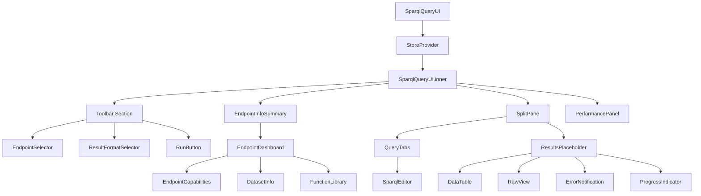

### Component Categories

#### Core Components
| Component | Description |
|-----------|-------------|
| `SparqlQueryUI` | Main entry point, wraps inner component with StoreProvider |
| `SparqlQueryUI.inner` | Main UI implementation, assembles all child components |
| `StoreProvider` | Creates isolated store instances via Svelte context |

#### Editor Components
| Component | Description |
|-----------|-------------|
| `SparqlEditor` | CodeMirror 6-based SPARQL editor with syntax highlighting, autocompletion, and linting |

#### Endpoint Components
| Component | Description |
|-----------|-------------|
| `EndpointSelector` | ComboBox for selecting endpoints from catalogue |
| `EndpointInput` | Text input for custom endpoint URLs |
| `EndpointInfoSummary` | Compact summary bar with expand/collapse |
| `EndpointDashboard` | Tabbed interface for capabilities, datasets, functions |

#### Capabilities Components
| Component | Description |
|-----------|-------------|
| `EndpointCapabilities` | Main capabilities display with tabs |
| `DatasetInfo` | Named/default graph information |
| `LanguageSupport` | SPARQL version support |
| `FeatureList` | Endpoint features (federation, etc.) |
| `FormatList` | Supported result/input formats |
| `FunctionLibrary` | Extension functions with search |
| `FunctionDetails` | Function documentation modal |

#### Results Components
| Component | Description |
|-----------|-------------|
| `ResultsPlaceholder` | Orchestrates result display based on state |
| `DataTable` | High-performance grid with virtual scrolling |
| `CellRenderer` | Type-aware SPARQL term rendering |
| `RawView` | Raw response with syntax highlighting |
| `ProgressIndicator` | Multi-phase execution progress |
| `ErrorNotification` | Error display with details |
| `DownloadButton` | Result download functionality |

#### Layout Components
| Component | Description |
|-----------|-------------|
| `SplitPane` | Resizable split pane with keyboard support |
| `QueryTabs` | Multi-tab query management |

## Data Flow

### Query Execution Flow

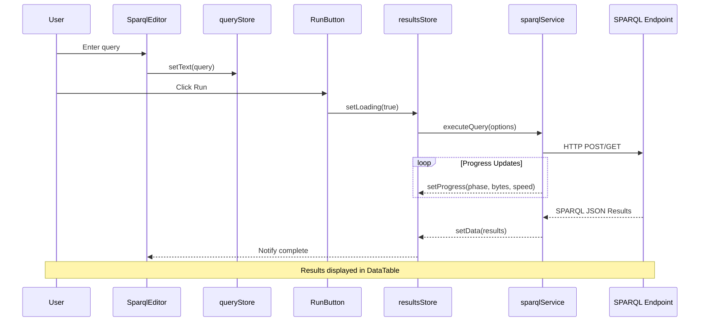

### Service Description Flow

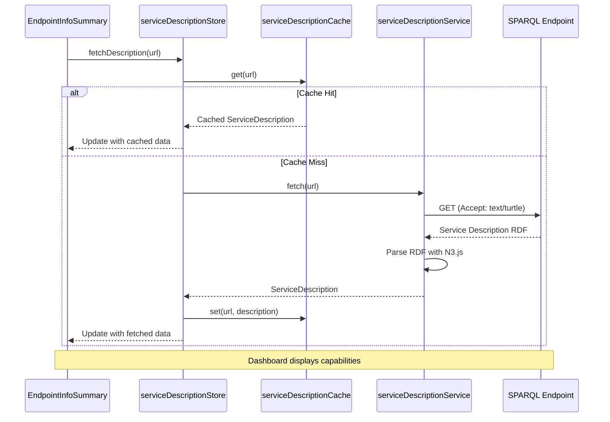

### Component State Flow

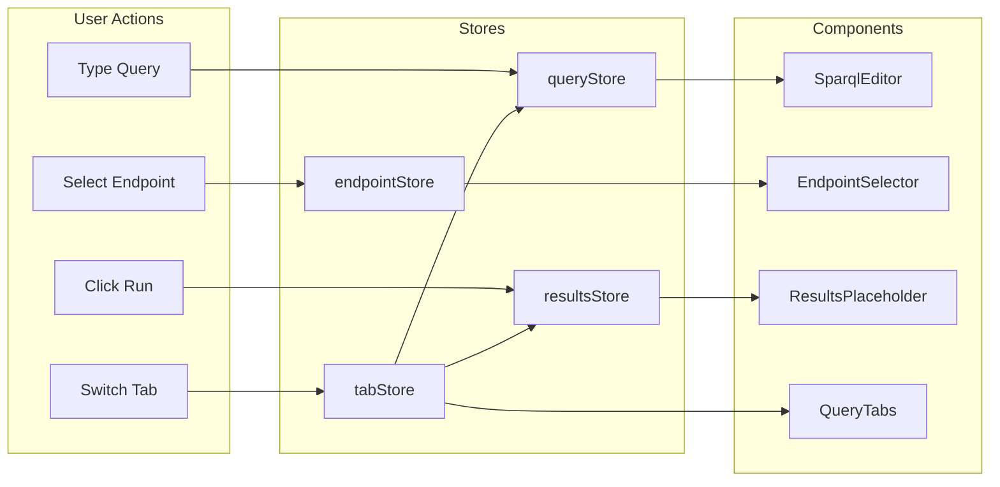

## Store Architecture

### Context-Based Store Isolation

Each `SparqlQueryUI` instance gets isolated store instances via Svelte 5's Context API:

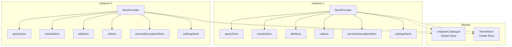

### Store Responsibilities

| Store | Purpose | State |
|-------|---------|-------|
| `queryStore` | Query text and metadata | `text`, `endpoint`, `prefixes`, `type` |
| `resultsStore` | Query results and execution state | `data`, `loading`, `error`, `progress`, `executionTime` |
| `tabStore` | Multi-tab management | `tabs[]`, `activeTabId` |
| `uiStore` | UI state (panels, modals) | Visibility flags, focus state |
| `serviceDescriptionStore` | Endpoint capabilities cache | `descriptions` Map, loading states |
| `settingsStore` | User preferences | `maxRows`, `timeout`, validation settings |
| `endpointStore` | Endpoint catalogue | Endpoint list (global, shared) |
| `themeStore` | Carbon theme | `current` (white/g10/g90/g100) |

### Factory Pattern

All stores use factory functions for isolation:

```typescript
// Create isolated store instances
const queryStore = createQueryStore();
const resultsStore = createResultsStore();
const tabStore = createTabStore(instanceId);

// Or use global singleton (fallback)
import { queryStore } from './stores/queryStore';
```

### Context Access

Components access stores via context utilities:

```typescript
// In component
import { getQueryStore, getResultsStore } from '$lib/stores/storeContext';

const queryStore = getQueryStore();
const resultsStore = getResultsStore();

// Subscribe to state
const state = $derived($queryStore);
```

## Service Layer

### Service Dependencies

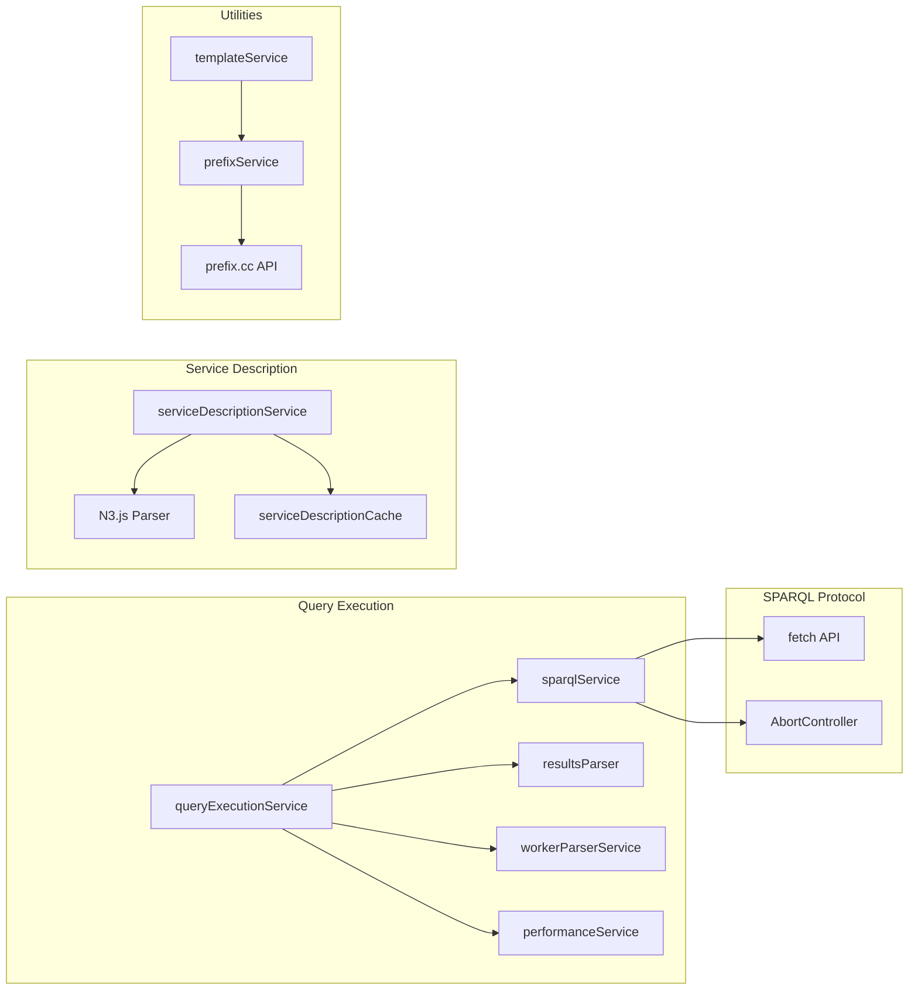

### Service Responsibilities

| Service | Purpose |
|---------|---------|
| `sparqlService` | SPARQL 1.2 Protocol implementation (GET/POST, content negotiation) |
| `prefixService` | Prefix management, IRI abbreviation, prefix.cc lookup |
| `templateService` | Query template management and substitution |
| `serviceDescriptionService` | Fetch and parse W3C Service Description RDF |
| `serviceDescriptionCache` | LRU cache with TTL for service descriptions |
| `performanceService` | Execution timing and metrics collection |
| `queryExecutionService` | Query execution orchestration with progress tracking |
| `workerParserService` | Web Worker-based result parsing for large datasets |

### Error Handling

Services use typed errors with categorization:

```typescript
interface QueryError {
  type: 'network' | 'cors' | 'timeout' | 'http' | 'sparql' | 'parse';
  message: string;
  details?: string;
  status?: number;
}
```

## Editor Architecture

### CodeMirror Integration

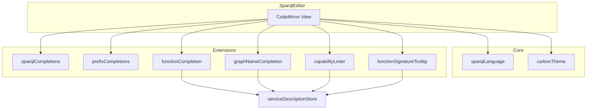

### Editor Extensions

| Extension | Purpose |
|-----------|---------|
| `sparqlLanguage` | SPARQL syntax definition and highlighting |
| `carbonTheme` | Carbon Design System color theme |
| `sparqlCompletions` | SPARQL keyword autocompletion |
| `prefixCompletions` | Prefix autocompletion from known prefixes |
| `functionCompletion` | Extension function autocompletion from service description |
| `graphNameCompletion` | Named graph autocompletion from service description |
| `capabilityLinter` | Lint queries against endpoint capabilities |
| `functionSignatureTooltip` | Hover tooltips for function signatures |

## Performance Optimizations

### Virtual Scrolling

DataTable uses wx-svelte-grid for efficient rendering of large datasets:

- **Virtual viewport**: Only renders visible rows
- **Row recycling**: Reuses DOM elements during scroll
- **Chunked loading**: Loads data in configurable chunks (default: 1000 rows)
- **Infinite scroll**: Loads more data on scroll near bottom

### Web Workers

Heavy parsing operations are offloaded to Web Workers:

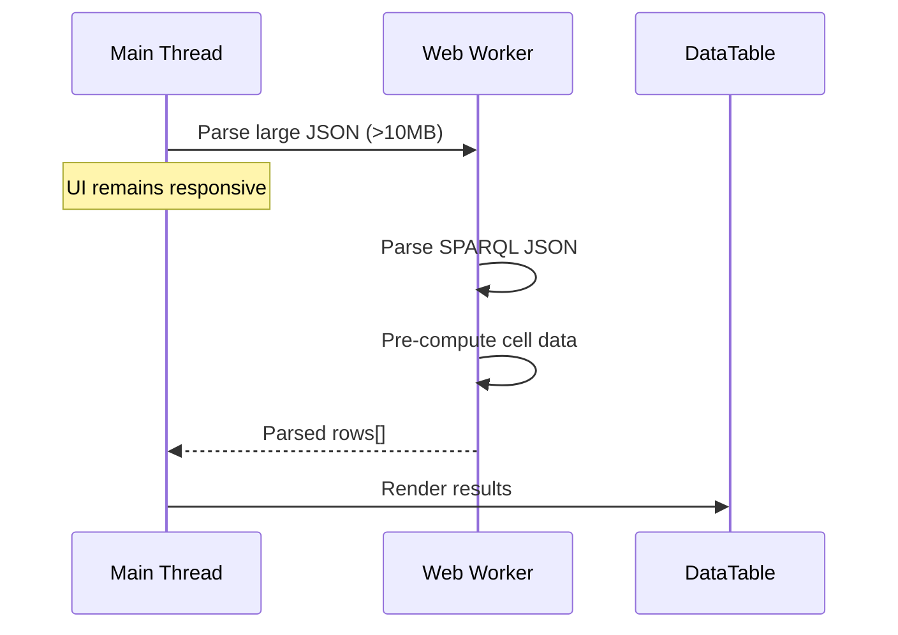

### Caching Strategy

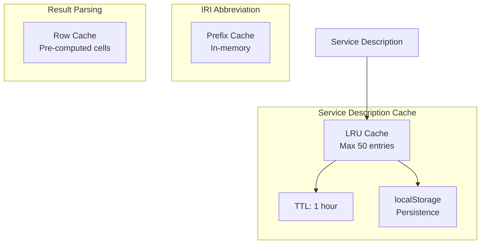

## Extension Points

### For Integrators

1. **Custom Endpoint Catalogue**
   ```typescript
   <SparqlQueryUI config={{
     endpoint: {
       catalogue: [
         { url: 'https://example.org/sparql', name: 'Example' }
       ]
     }
   }} />
   ```

2. **Custom Templates**
   ```typescript
   <SparqlQueryUI config={{
     templates: [
       { name: 'Custom', query: 'SELECT * WHERE { ?s ?p ?o } LIMIT 10' }
     ]
   }} />
   ```

3. **Custom Prefixes**
   ```typescript
   <SparqlQueryUI config={{
     prefixes: {
       default: { ex: 'http://example.org/' }
     }
   }} />
   ```

4. **Prefix Discovery Hook**
   ```typescript
   <SparqlQueryUI config={{
     prefixes: {
       discoveryHook: async (iri) => {
         // Return { prefix, uri } or null
       }
     }
   }} />
   ```

5. **Programmatic Store Access**
   ```typescript
   import { createQueryStore, createResultsStore } from 'sparql-query-ui';

   const queryStore = createQueryStore();
   queryStore.setText('SELECT * WHERE { ?s ?p ?o }');
   ```

### For Contributors

1. **New Components**: Use `StoreProvider` context pattern
2. **New CodeMirror Extensions**: Add to `src/lib/editor/extensions/`
3. **New Services**: Follow singleton pattern with factory export
4. **New Stores**: Implement factory function and context key
5. **New Result Formats**: Implement parser and register in `sparqlService`

## Testing Architecture

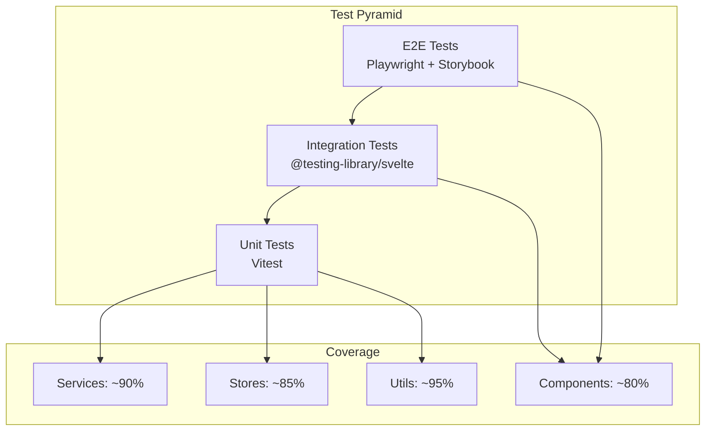

### Test Types

| Type | Framework | Purpose |
|------|-----------|---------|
| Unit | Vitest | Service logic, utilities, pure functions |
| Integration | Vitest + testing-library | Component rendering, store interactions |
| Storybook | Storybook + play functions | Visual documentation, interaction testing |
| E2E | Playwright | Browser testing, accessibility, real workflows |

## Accessibility (WCAG 2.1 AA)

### Compliance Areas

- **Keyboard Navigation**: All interactive elements accessible via keyboard
- **Screen Readers**: Proper ARIA labels and live regions
- **Focus Management**: Logical focus order, visible focus indicators
- **Color Contrast**: Carbon Design System ensures AA compliance
- **Resizable Text**: Responsive typography with relative units
- **Touch Targets**: Minimum 44x44px touch areas

### Key Accessibility Features

| Feature | Implementation |
|---------|----------------|
| Skip links | Focus jumps to main content |
| Live regions | Status announcements for async operations |
| Modal focus trap | Focus constrained within modals |
| Error announcements | Screen reader notifications for errors |
| Keyboard shortcuts | Documented and accessible |

## Build and Packaging

### Build Outputs

```
package/              # NPM package (svelte-package)
├── index.js         # Main entry point
├── index.d.ts       # TypeScript declarations
├── components/      # Compiled components
├── services/        # Compiled services
├── stores/          # Compiled stores
└── types/           # Type definitions

dist-standalone/     # Standalone demo (Vite build)
├── index.html      # Demo page
├── assets/         # Bundled JS/CSS
└── carbon/         # Carbon theme CSS
```

### Package Exports

```json
{
  "exports": {
    ".": {
      "types": "./package/index.d.ts",
      "svelte": "./package/index.js",
      "default": "./package/index.js"
    }
  }
}
```

## Security Considerations

### Content Security Policy

Recommended CSP for production:

```
default-src 'self';
script-src 'self';
style-src 'self' 'unsafe-inline';
connect-src 'self' https://*.example.org;
font-src 'self';
```

### Offline Mode

SQUI supports fully offline operation:

- All assets bundled locally (no CDN dependencies)
- External prefix lookup can be disabled
- Service descriptions cached locally

See [SECURITY.md](./SECURITY.md) for detailed security documentation.

## Related Documentation

- [API Reference](./API.md) - Component, service, and store APIs
- [Security Guide](./SECURITY.md) - Security considerations and CSP
- [README](../README.md) - Getting started and basic usage
